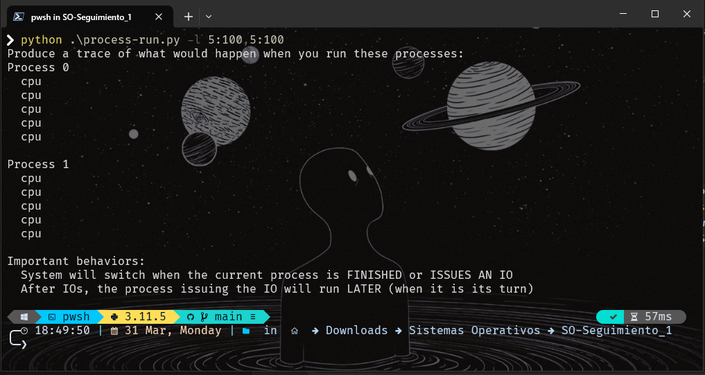
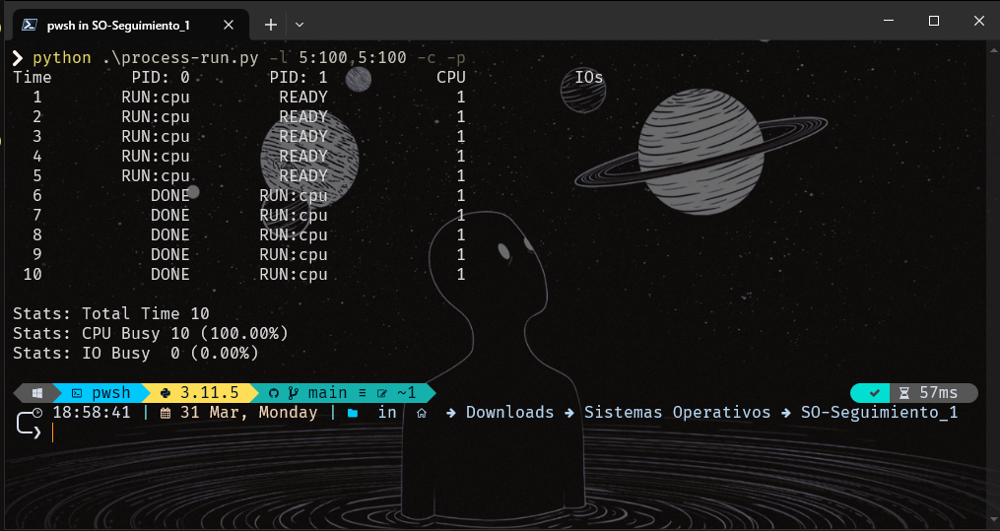
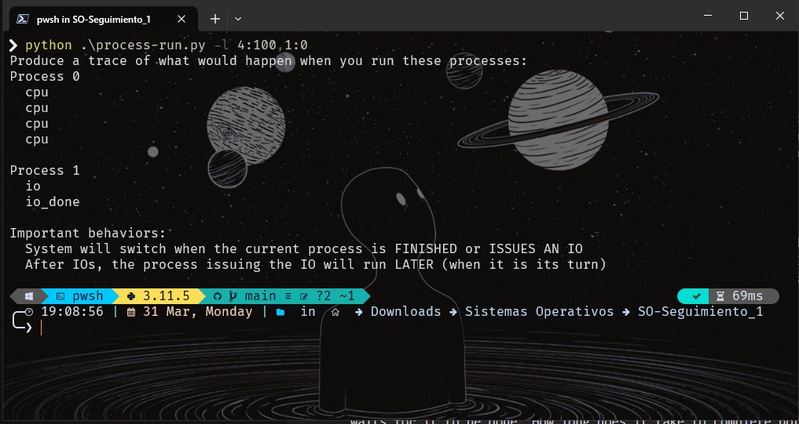
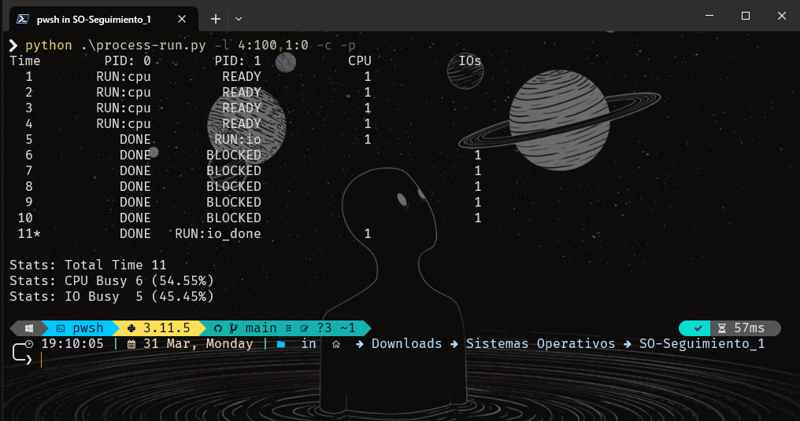
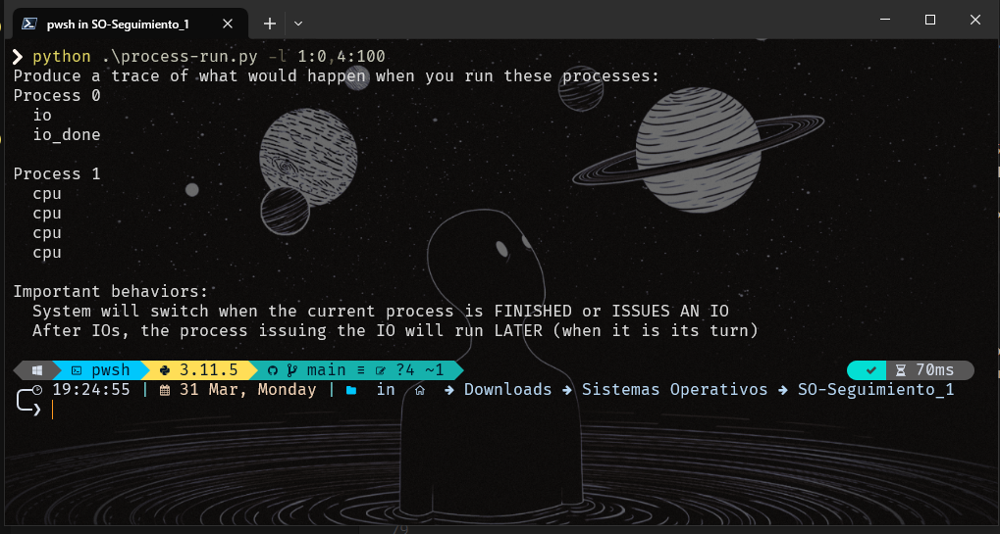
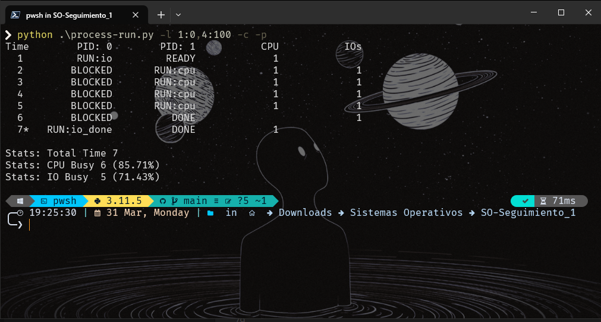
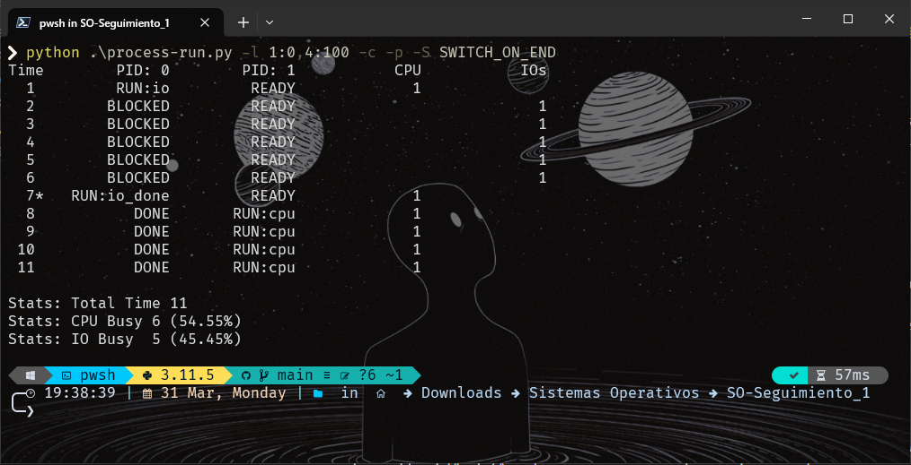
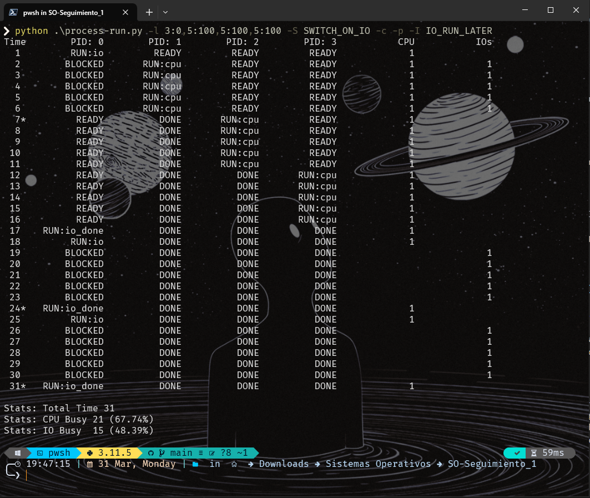

# Actividad de seguimiento - Simulación 1

|Integrante|correo|usuario github|
|---|---|---|
|David Camilo García Echavarría|davidc.garcia@udea.edu.co|davidc-garciae|
|Nombre completo integrante 2|correo integrante 2|gihub user integrante 2|

## Instrucciones 📝

Antes de empezar a realizar esta actividad haga un **fork** de este repositorio y sobre este trabaje en la solución de las preguntas planteadas en la actividad de simulación. Las respuestas deben ser respondidas en español o si lo prefiere en ingles en el lugar señalado para ello (La palabra **answer** muestra donde).

**Importante** ⚠️:
* Como la actividad es en las parejas del laboratorio, solo uno de los integrantes tiene que hacer el fork; y sobre repositorio bifurcado que se genera, la modificación se realiza en equipo.
* Como la entrega se debe hacer modificando el archivo READNE, se recomienda que consulte mas sobre el lenguaje **Markdown**. En el repo adjuntan dos cheatsheet ([cheat sheet 1](Markdown_Cheat_Sheet.pdf), [cheatsheet 2](markdown-cheatsheet.pdf)) para consulta rápida.
* Entre más creativo mejor 🌟.

## Homework (Simulation) 💻

This program, [`process-run.py`](process-run.py), allows you to see how process states change as programs run and either use the CPU (e.g., perform an add instruction) or do I/O (e.g., send a request to a disk and wait for it to complete). See the [README](https://github.com/remzi-arpacidusseau/ostep-homework/blob/master/cpu-intro/README.md) for details.

### Questions 🤔

1. Run `process-run.py` with the following flags: `-l 5:100,5:100`. What should the CPU utilization be (e.g., the percent of time the CPU is in use?) Why do you know this? Use the `-c` and `-p` flags to see if you were right.

   

   
Answer

   La CPU está en uso el 100% del tiempo. 🖥️

   

   ### Explicación:
   - Se ejecutaron dos procesos con la bandera `-l 5:100,5:100`, lo que significa que cada proceso tiene 5 instrucciones que utilizan la CPU.
   - Como solo hay tareas de CPU y no de I/O, el sistema nunca está inactivo.
   - El primer proceso (PID: 0) ejecuta sus 5 instrucciones y luego finaliza.
   - Luego, el segundo proceso (PID: 1) ejecuta sus 5 instrucciones y también finaliza.
   - Como ambos procesos usan CPU constantemente sin esperas por I/O, el tiempo total de ejecución es **10 unidades de tiempo** y la CPU estuvo ocupada durante **10 de 10 unidades de tiempo**.

   

   ### Confirmación con estadísticas:
   `Stats: Total Time 10 Stats: CPU Busy 10 (100.00%) Stats: IO Busy 0 (0.00%)`
   Esto valida que la CPU se mantuvo ocupada todo el tiempo, sin momentos de inactividad ni espera de I/O. ✅

   

    

2. Now run with these flags: `./process-run.py -l 4:100,1:0`. These flags specify one process with 4 instructions (all to use the CPU), and one that simply issues an I/O and waits for it to be done. How long does it take to complete both processes? Use `-c` and `-p` to find out if you were right.

   

   
Answer

   
   El tiempo total para completar ambos procesos es **11 unidades de tiempo** ⏳.  
   

   ### Explicación:
   - El primer proceso (PID: 0) ejecuta sus 4 instrucciones de CPU seguidas.
   - Luego, el segundo proceso (PID: 1) se ejecuta y emite una operación de I/O en el tiempo 5.
   - Una vez emitida la I/O, el proceso entra en estado **BLOCKED** y permanece así por 5 unidades de tiempo (de 6 a 10), esperando que la operación de I/O se complete.
   - En el tiempo **11**, el proceso sale del estado bloqueado (`RUN:io_done`), completando su ejecución.

   

   ### Confirmación con estadísticas:
   - La CPU estuvo activa **6 de 11 unidades de tiempo** (54.55%).
   - El dispositivo de I/O estuvo ocupado **5 de 11 unidades de tiempo** (45.45%).

   Esto demuestra que el sistema alternó entre ejecución de CPU y espera de I/O, afectando la eficiencia general del CPU. ⚙️
   

   

    

3. Switch the order of the processes: `-l 1:0,4:100`. What happens now? Does switching the order matter? Why? (As always, use `-c` and `-p` to see if you were right)

   

   
Answer

   Al cambiar el orden de los procesos con las banderas `-l 1:0,4:100`, el tiempo total de ejecución es 7 unidades de tiempo. ⏱️

   

   ### Explicación:
   - En este caso, el primer proceso (PID: 0) emite una operación de I/O en la primera unidad de tiempo y luego entra en estado **BLOCKED** mientras espera la finalización de la I/O.
   - Mientras tanto, el segundo proceso (PID: 1) ejecuta sus 4 instrucciones de CPU sin interrupciones.
   - Después de que PID: 1 termina, el proceso PID: 0 reanuda su ejecución, finalizando en el tiempo 7.

   ### ¿El orden afecta el comportamiento?
   Sí, el orden de los procesos influye en el uso de la CPU. El primer proceso (PID: 0) emite I/O de inmediato, lo que deja la CPU disponible para el segundo proceso (PID: 1). 🔄

   

   ### Confirmación con estadísticas:
   `Stats: Total Time 7 Stats: CPU Busy 6 (85.71%) Stats: IO Busy 5 (71.43%)`
   - La CPU estuvo ocupada **6 de 7 unidades de tiempo** (85.71%).
   - El dispositivo de I/O estuvo ocupado **5 de 7 unidades de tiempo** (71.43%).

   Esto demuestra cómo la ejecución de I/O en el primer proceso afecta el uso de la CPU y el dispositivo de I/O. 🔄⚡
   

    

4. We'll now explore some of the other flags. One important flag is `-S`, which determines how the system reacts when a process issues an I/O. With the flag set to SWITCH ON END, the system will NOT switch to another process while one is doing I/O, instead waiting until the process is completely finished. What happens when you run the following two processes (`-l 1:0,4:100 -c -S SWITCH ON END`), one doing I/O and the other doing CPU work?

   

   
Answer

   Al usar la opción `-S SWITCH_ON_END`, el comportamiento de la ejecución cambia de la siguiente manera:  

   ### Explicación:
   - El primer proceso (PID: 0) comienza con una instrucción de I/O, lo que lo pone en estado **BLOCKED** mientras espera que se complete la operación de I/O.
   - A pesar de que el segundo proceso (PID: 1) está listo para ejecutarse, el sistema no cambia a PID: 1 hasta que PID: 0 termine completamente, ya que la opción `SWITCH_ON_END` evita el cambio de proceso mientras uno esté haciendo I/O.
   - Solo después de que PID: 0 haya completado la I/O y esté listo para ejecutar en la CPU, el sistema cambiará al proceso PID: 1.
   - Luego de la finalización de PID: 0, el proceso PID: 1 ejecuta sus instrucciones de CPU.

   ### Comportamiento de cambio:
   El sistema espera a que el proceso actual termine completamente antes de cambiar a otro proceso, incluso si el otro proceso está listo para ejecutarse. 🛑

   

   ### Confirmación con estadísticas:
   `Stats: Total Time 11 Stats: CPU Busy 6 (54.55%) Stats: IO Busy 5 (45.45%)`
   - La CPU estuvo ocupada **6 de 11 unidades de tiempo** (54.55%).
   - El dispositivo de I/O estuvo ocupado **5 de 11 unidades de tiempo** (45.45%).

   Este resultado muestra cómo la política de "esperar al final" para cambiar de proceso afecta el uso del CPU y I/O, ya que la CPU estuvo ocupada menos tiempo debido a que no se aprovechó el tiempo de inactividad del proceso que estaba esperando I/O. ⏳

   

    

5. Now, run the same processes, but with the switching behavior set to switch to another process whenever one is WAITING for I/O (`-l 1:0,4:100 -c -S SWITCH ON BLOCK`). What happens now? What impact does this have on CPU utilization? ⚙️

   

   
Answer

   Al usar la opción `SWITCH_ON_BLOCK`, el sistema cambiará al siguiente proceso siempre que el proceso actual esté esperando I/O. El comportamiento es el siguiente:

   ### Explicación:
   - El primer proceso (PID: 0) emite una I/O y entra en estado **BLOCKED**.
   - Debido a que el sistema cambia de proceso en cuanto un proceso entra en estado bloqueado, el sistema pasa inmediatamente al segundo proceso (PID: 1) para que ejecute sus instrucciones de CPU.
   - Una vez que PID: 1 finaliza, el sistema retoma el proceso PID: 0 para completar la ejecución de I/O.

   ### Impacto en el uso de CPU:
   La CPU está ocupada más tiempo, ya que no se pierde el tiempo esperando. Se aprovecha al máximo la CPU al ejecutar el segundo proceso mientras el primero espera I/O. 🏃‍♂️

   

   ### Confirmación con estadísticas:
   `Stats: Total Time 7 Stats: CPU Busy 6 (85.71%) Stats: IO Busy 5 (71.43%)`

   La CPU estuvo ocupada **6 de 7 unidades de tiempo** (85.71%), lo que muestra que la política de cambio en bloque mejora la utilización de la CPU. 🔄
   

    

6. One other important behavior is what to do when an I/O completes. With `-I IO RUN LATER`, when an I/O completes, the process that issued it is not necessarily run right away; rather, whatever was running at the time keeps running. What happens when you run this combination of processes? (`./process-run.py -l 3:0,5:100,5:100,5:100 -S SWITCH ON IO -c -p -I IO RUN LATER`) Are system resources being effectively utilized? 🤔

   

   
Answer

   
   Al usar la opción `-I IO_RUN_LATER`, el sistema cambia su comportamiento respecto a cómo maneja la finalización de las operaciones de I/O.

   ### Explicación:
   - Cuando se utiliza `-I IO_RUN_LATER`, el sistema no ejecuta inmediatamente el proceso que completó una operación de I/O. En lugar de eso, deja que el proceso que estaba en ejecución continúe hasta que termine su ciclo de CPU. ⏳
   - En el caso de que varios procesos estén esperando I/O, el sistema no les da prioridad inmediatamente después de completar el I/O, lo que provoca que el proceso que estaba en ejecución (por ejemplo, el de la CPU) continúe hasta que termine su turno.

   ### Comportamiento observado:
   - Los procesos PID: 0 y PID: 1 inician su I/O, pero el proceso de CPU (PID: 2, PID: 3, etc.) sigue ejecutándose mientras otros procesos están esperando para iniciar o completar su I/O. ⌛
   - Esto hace que los procesos se "acumulen" en espera de I/O, pero no se les da prioridad inmediata después de completar la I/O.

   

   ### Confirmación con estadísticas:
   `Stats: Total Time 31 Stats: CPU Busy 21 (67.74%) Stats: IO Busy 15 (48.39%)`
   - La CPU estuvo ocupada **21 de 31 unidades de tiempo** (67.74%).
   - El dispositivo de I/O estuvo ocupado **15 de 31 unidades de tiempo** (48.39%).

   ### Análisis:
   - El comportamiento de `IO_RUN_LATER` resulta en una menor eficiencia en el uso de los recursos del sistema, ya que los procesos que completaron su I/O no se ejecutan inmediatamente, y otros procesos pueden quedar bloqueados mientras esperan que se liberen los recursos de CPU o I/O. 🛑
   - En este caso, el sistema no está maximizando el uso de los recursos de I/O y CPU en paralelo, lo que podría llevar a un mayor tiempo total de ejecución. 🕰️

   

    

7. Now run the same processes, but with `-I IO RUN IMMEDIATE` set, which immediately runs the process that issued the I/O. How does this behavior differ? Why might running a process that just completed an I/O again be a good idea? ⚡

   

   
Answer

   
   Al usar la opción `-I IO_RUN_IMMEDIATE`, el sistema cambia el comportamiento respecto a cómo maneja la finalización de las operaciones de I/O. 

   ### Explicación:
   - Cuando se utiliza `-I IO_RUN_IMMEDIATE`, el sistema ejecuta inmediatamente el proceso que completó una operación de I/O, lo que permite que los procesos que están esperando para completar I/O sean ejecutados de inmediato. 🔄
   - Este comportamiento contrasta con el de `IO_RUN_LATER`, donde el proceso que completó su I/O debe esperar hasta que la CPU termine su ciclo actual.

   

   ### Comportamiento observado:
   - En el caso de varios procesos con operaciones I/O, tan pronto como un proceso termina su I/O, se ejecuta de inmediato en lugar de esperar.
   - El sistema cambia rápidamente entre las operaciones de CPU y I/O, lo que hace un uso más eficiente de los recursos. ⚡

   ### Confirmación con estadísticas:
   `Stats: Total Time 21 Stats: CPU Busy 21 (100.00%) Stats: IO Busy 15 (71.43%)`
   - La CPU estuvo ocupada **21 de 21 unidades de tiempo** (100%).
   - El dispositivo de I/O estuvo ocupado **15 de 21 unidades de tiempo** (71.43%).

   ### Análisis:
   - El comportamiento de `IO_RUN_IMMEDIATE` mejora significativamente la utilización de la CPU, ya que la CPU estuvo ocupada durante todo el tiempo disponible. 💻
   - El uso de I/O sigue siendo alto, pero al permitir la ejecución inmediata de los procesos de I/O, se consigue un balance eficiente entre los procesos de CPU y I/O, reduciendo el tiempo total necesario para completar todas las tareas. ⏱️

   

    

   
## Referencias 📚
1. [Introducción a la CPU y Memoria - OSTEP](https://github.com/remzi-arpacidusseau/ostep-homework/tree/master/cpu-intro) 
2. [Archivos Cheat Sheet Markdown](Markdown_Cheat_Sheet.pdf)
